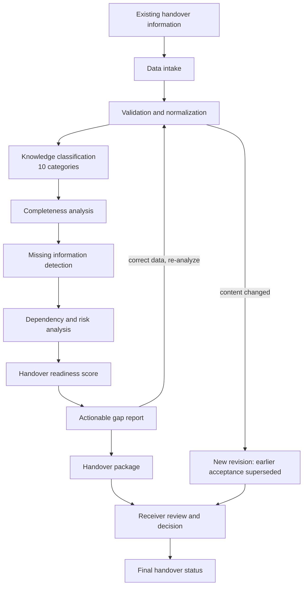
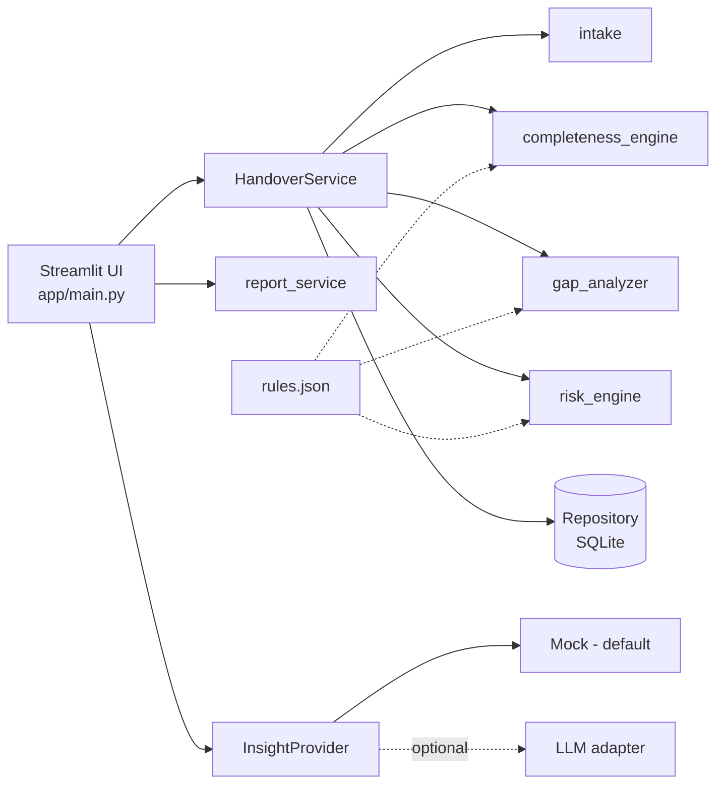

# ContextRelay AI — business flow and components

## Business flow

```mermaid
flowchart TD
    I[Existing handover information] --> A[Data intake]
    A --> B[Validation and normalization]
    B --> C[Knowledge classification<br/>10 categories]
    C --> D[Completeness analysis]
    D --> E[Missing information detection]
    E --> F[Dependency and risk analysis]
    F --> G[Handover readiness score]
    G --> H[Actionable gap report]
    H -->|correct data, re-analyze| B
    H --> J[Handover package]
    J --> K[Receiver review and decision]
    K --> L[Final handover status]
    B -->|content changed| M[New revision: earlier acceptance superseded]
    M --> K
```

## Components

```mermaid
flowchart LR
    UI[Streamlit UI<br/>app/main.py] --> SVC[HandoverService]
    SVC --> INT[intake]
    SVC --> CE[completeness_engine]
    SVC --> GA[gap_analyzer]
    SVC --> RE[risk_engine]
    SVC --> REPO[(Repository<br/>SQLite)]
    UI --> RPT[report_service]
    UI --> PROV[InsightProvider]
    PROV --> MOCK[Mock - default]
    PROV -.optional.-> LLM[LLM adapter]
    CFG[rules.json] -.-> CE & GA & RE
```
